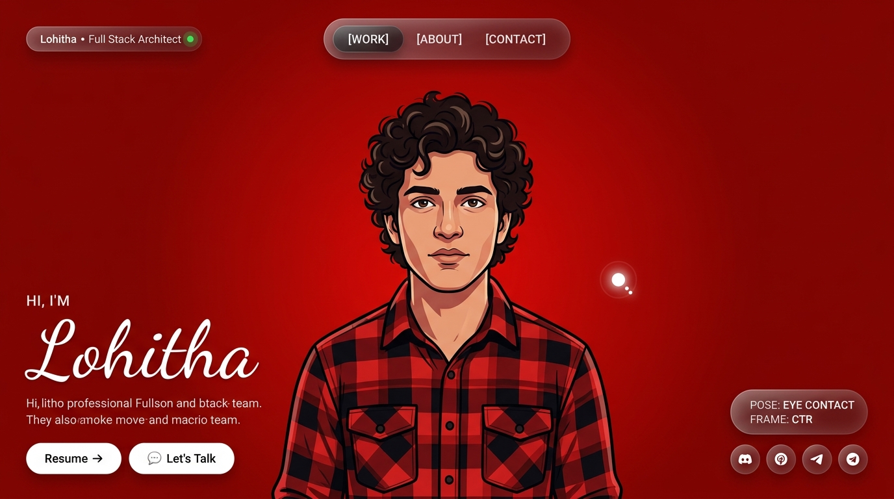

# Vivek Kumar Maurya — Interactive Portfolio

> **Vibe coded** with [Antigravity IDE](https://antigravity.dev) + Gemini ✨

[](https://www.linkedin.com/in/vivek-kumar-maurya-bb754028a/)
[](https://github.com/vivek-dev302)
[](mailto:vivekmaurya9612@gmail.com)

A luxury, award-winning portfolio hero section featuring a real-time **60 FPS zero-lag cursor-tracking character** — the character's head follows your cursor across a full 360° rotation, pre-extracted as 64 seamless WebP frames using Python & OpenCV.

---



---

## ✨ Features

- **Zero-lag gaze tracking** — character head follows your cursor via `atan2` angle + framerate-independent exponential lerp
- **64 pre-extracted WebP frames** — no runtime video seeking, no lag, no ghosting
- **Center eye-contact deadzone** — move cursor over the face for direct eye contact
- **Seamless background matching** — exact `#eb0d0b` color detected and matched across all frames
- **Frosted-glass UI** — floating pill nav, glassmorphism modals, magnetic custom cursor
- **Web Audio API** — subtle micro-sound feedback on hover and eye contact
- **60 FPS canvas renderer** — `requestAnimationFrame` loop with delta-time smoothing, zero React re-render overhead on hot path

## 🛠 Tech Stack

| Layer | Tech |
|---|---|
| Framework | React 19 + Vite 6 |
| Rendering | HTML5 Canvas 2D (60fps rAF loop) |
| Frame Extraction | Python + OpenCV (`cv2`) |
| Styling | Vanilla CSS (glassmorphism, custom cursor) |
| Icons | Lucide React |
| Fonts | Dancing Script, Outfit, Plus Jakarta Sans, Space Grotesk |

## 🚀 Run Locally

```bash
# Install dependencies
npm install

# Start dev server
npm run dev
```

Then open [http://localhost:5173](http://localhost:5173)

## 📸 Frame Extraction (if you swap the video)

1. Replace `public/character.mp4`
2. Run `python inspect_video.py` to detect the background color
3. Update frame anchor numbers in `extract_smooth_frames.py`
4. Run `python extract_smooth_frames.py`
5. Done — the app picks up the new frames instantly

## 📁 Structure

```
├── public/
│   ├── character.mp4          # Source animation video
│   ├── character_image.png    # Center forward-facing pose
│   └── frames/                # 64 pre-extracted WebP frames + center.webp
├── src/
│   ├── components/
│   │   ├── HeroCanvas.jsx     # 60fps canvas gaze tracker
│   │   ├── CustomCursor.jsx   # Magnetic cursor + trailing ring
│   │   ├── Navigation.jsx     # Frosted-glass nav pill
│   │   ├── HeroContent.jsx    # Bottom-left typography + CTAs
│   │   ├── TrackerHUD.jsx     # Live gaze telemetry HUD
│   │   └── Modals.jsx         # Work / About / Contact / Resume modals
│   ├── utils/audio.js         # Web Audio API micro-feedback
│   └── index.css              # Luxury design system
└── extract_smooth_frames.py   # Frame extraction pipeline
```

---

*Built in one session. Vibe coded.*
